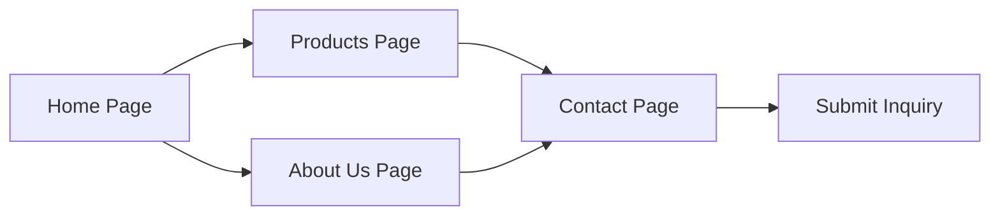

## 1. Product Overview

Ningbo Best Mind Garment (BMG) corporate website — a streetwear-styled showcase for a professional knitwear OEM manufacturer serving international clients. The site positions BMG as a reliable, creative partner for streetwear and casual apparel brands seeking custom manufacturing services including garment washing, printing, and embroidery.

- **Target users**: International streetwear brands, fashion labels, and buyers from Europe, America, Canada, Brazil, and worldwide
- **Core value**: Establish brand credibility, showcase manufacturing capabilities, and drive inquiry generation

## 2. Core Features

### 2.1 Feature Module
1. **Home page**: hero section with bold streetwear visual, company intro snapshot, product highlights, service features, CTA
2. **About Us page**: company story, manufacturing capabilities, factory info, brand partners, core values
3. **Products page**: product categories (T-Shirts, Polos, Sweatshirts & Hoodies, Fleece Pants), product gallery with custom service tags
4. **Contact page**: contact info, inquiry form, location map placeholder

### 2.2 Page Details
| Page Name | Module Name | Feature description |
|-----------|-------------|---------------------|
| Home | Navigation | Sticky nav with logo, menu links, hover effects |
| Home | Hero | Full-viewport hero with bold typography, streetwear imagery, animated tagline, CTA button |
| Home | Intro Snapshot | 3-column feature grid (OEM Service, Custom Techniques, Fast Delivery) |
| Home | Product Highlights | Horizontal scroll product showcase with streetwear styling |
| Home | Service Capabilities | Garment wash / print / embroidery showcase with visuals |
| Home | CTA Section | Bold call-to-action banner with contact button |
| Home | Footer | Company info, navigation links, social icons |
| About Us | Page Header | Large page title with streetwear graphic treatment |
| About Us | Company Story | Who We Are section with brand narrative |
| About Us | Stats | Factory size, staff count, monthly output, years of experience |
| About Us | Partners | Brand logo wall (LPP, UMBRO, LOTTO, SCOTCH SODA, GUESS, etc.) |
| About Us | Factory Info | Manufacturing capabilities description |
| Products | Page Header | Bold title with category tags |
| Products | Category Filter | Tabs for product categories |
| Products | Product Grid | Asymmetric grid with product cards, hover effects |
| Products | Service Badges | Wash / Print / Embroidery tags on products |
| Contact | Page Header | Bold title with graphic element |
| Contact | Contact Info | Email, phone, address with iconography |
| Contact | Inquiry Form | Name, email, subject, message fields with submit button |
| Contact | Map Placeholder | Stylized map/location graphic |

## 3. Core Process

User visits the website → browses home page to understand company positioning → navigates to Products to see capabilities → reads About Us to verify credibility → submits inquiry via Contact page or clicks CTA buttons.

## 4. User Interface Design

### 4.1 Design Style
- **Primary color**: Black / Off-black (#0a0a0a) — streetwear staple, bold and clean
- **Secondary color**: Neon lime / Acid green (#d4ff00) — high-contrast accent, streetwear energy
- **Tertiary color**: White (#ffffff) for text and negative space
- **Background**: Deep black with subtle grain texture and occasional diagonal graphic elements
- **Button style**: Bold rectangular buttons with sharp corners, neon accent on hover, all-caps text
- **Fonts**: 
  - Display: **Bebas Neue** or **Oswald** (bold, condensed, impactful headlines)
  - Body: **Space Mono** or **JetBrains Mono** (industrial/tech feel, pairs with street aesthetic)
- **Layout style**: Asymmetric grid, overlapping elements, diagonal dividers, large typography, generous negative space
- **Visual elements**: Noise/grain texture overlay, geometric shapes, barcode/stencil graphics, tape/sticker elements, spray-paint effects
- **Icons**: Bold line icons, stencil-style, or simple geometric marks

### 4.2 Page Design Overview
| Page Name | Module Name | UI Elements |
|-----------|-------------|-------------|
| Home | Hero | Full-screen black bg, huge condensed display type, neon accent line, model wearing streetwear, staggered text reveal animation |
| Home | Product Highlights | Diagonal section divider, product cards with neon outline on hover, horizontal scroll on mobile |
| Home | Service Capabilities | 3-column layout with numbered stencil-style markers, before/after visual hints |
| About Us | Stats | Large monospace numbers with neon accents, 2x2 grid on desktop |
| Products | Product Grid | Masonry/asymmetric grid, product cards with category tags, hover zoom + neon border |
| Contact | Inquiry Form | Minimal black form with neon focus states, monospace labels, bold submit button |

### 4.3 Responsiveness
- Desktop-first design (1920px baseline)
- Breakpoints: 1200px, 768px, 480px
- Mobile: hamburger menu, stacked layouts, touch-optimized buttons (min 44px height)
- Horizontal scroll sections on mobile for product showcases

### 4.4 Motion & Animation
- Page load: staggered text reveals from bottom/left
- Scroll-triggered: fade-in + slide-up for sections
- Hover: neon glow, slight scale, underline sweep
- Cursor: custom cursor with dot and ring that reacts to hoverable elements
- Product cards: lift on hover, image subtle zoom
- Navigation: smooth scroll, active state indicator
