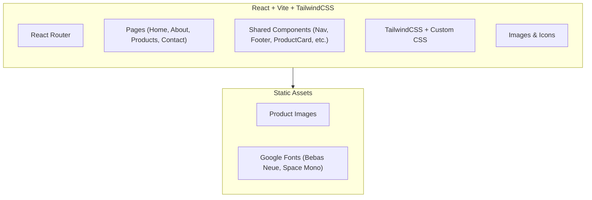

## 1. Architecture Design



## 2. Technology Description

- **Frontend**: React@18 + Vite + TailwindCSS@3
- **Routing**: React Router DOM@6
- **Styling**: TailwindCSS with custom theme (colors, fonts, animations)
- **Fonts**: Google Fonts (Bebas Neue for display, Space Mono for body)
- **Icons**: Lucide React (custom-styled to match street aesthetic)
- **Animations**: CSS transitions + Framer Motion (for scroll animations and staggered reveals)
- **Build tool**: Vite
- **No backend**: Static site with mock data, contact form as client-side demo

## 3. Route Definitions

| Route | Purpose |
|-------|---------|
| `/` | Home page — hero, company snapshot, product highlights, services, CTA |
| `/about` | About Us page — company story, stats, partners, factory info |
| `/products` | Products page — category filter, product grid, service badges |
| `/contact` | Contact page — contact info, inquiry form, location |

## 4. Project Structure

```
src/
├── components/
│   ├── Navbar.jsx          # Sticky navigation
│   ├── Footer.jsx          # Site footer
│   ├── ProductCard.jsx     # Reusable product card
│   ├── ServiceCard.jsx     # Service feature card
│   ├── SectionTitle.jsx    # Styled section heading
│   └── CustomCursor.jsx    # Custom cursor (desktop only)
├── pages/
│   ├── Home.jsx            # Home page
│   ├── About.jsx           # About page
│   ├── Products.jsx        # Products page
│   └── Contact.jsx         # Contact page
├── data/
│   ├── products.js         # Product mock data
│   └── company.js          # Company info data
├── App.jsx                 # App with router
├── main.jsx                # Entry point
└── index.css               # Global styles + Tailwind directives
```

## 5. Key Technical Decisions

1. **CSS approach**: TailwindCSS utility-first with custom theme extensions for the streetwear color palette and typography
2. **Animations**: Framer Motion for scroll-triggered animations and page transitions; CSS for hover states
3. **Images**: Use text-to-image API for product and hero imagery with streetwear aesthetic
4. **Responsive**: Desktop-first with Tailwind breakpoints (lg, md, sm)
5. **Performance**: Static site, optimized images, minimal dependencies
